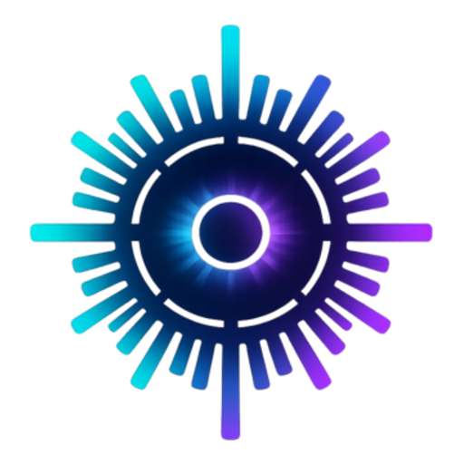

<div align="center">
  
  <h1>EStudio</h1>
  <p><strong>Create loopable video content from footage, music, reactive visuals, and animated captions.</strong></p>
  <p>A self-hosted studio for shaping, previewing, rendering, and managing short-form media.</p>
</div>

---

EStudio is a self-hosted app for producing short-form, loopable video content. Each project combines a source video, a thumbnail, and a music track. Choose either a landscape loop or a portrait-first short, then set the output size and frame rate, source segment length, playback speed, framing scale, and the crossfade between repeated video segments. Select the start and end of the music range, optionally synchronize audio fades with the visual intro and outro, and preview the composition before rendering.

The composition can add spectrum bars and edge glow that react to the soundtrack, with controls for intensity, bar count, and vocal balance. Optional motion and image treatment controls adjust the visual feel. Captions can be transcribed from the song using a configured OpenAI Whisper, local Whisper, or companion captions API backend; the word timings can then be reviewed and edited in the caption editor. Choose subtitle or TikTok-style captions, their placement and scale, words per page, and an animation preset. A performance preview is also available to check captions and audio without rendering the full visual effects.

After setup, EStudio keeps projects and their source assets in a searchable library, queues render and caption work, and reports job progress and notifications in the studio. Video rendering uses Remotion and can run on the local worker or an optional AWS Remotion Lambda backend. A rendered project can be uploaded or scheduled to YouTube after connecting a provider account and configuring the required credentials. The app is designed to manage this production workflow in one place; it does not generate the source footage or music for you.

## What the web app does

### Create and edit loop projects

The guided upload flow creates a project from a thumbnail image, video clip, and song. It supports two composition modes: a landscape video loop and a portrait-first short loop. The editor provides a live Remotion preview and controls for:

- Output preset or custom dimensions, frame rate, video segment duration, playback speed, and scale/crop framing.
- Crossfade overlap between repeated source-video segments, plus optional visual intro/outro fades.
- Song playback start/end range, audio fade length and offsets, and syncing audio fades to the visual fades.
- Audio-reactive spectrum bars and edge glow, including bar count, intensity, and vocal balance; optional motion response and sharpening/color adjustments.
- Automatic palette selection or a custom palette.
- Optional captions with a language hint, subtitle or TikTok-style treatment, screen position, size, words per page, and smooth, cinematic, punch, cascade, or minimal animation.

Projects can be updated after upload, including their title, mode, settings, and palette. The library organizes projects and their render variants, while the dashboard summarizes recent projects and render status. A storage rescan tool can restore project records from the configured content storage when records are missing.

### Captions, rendering, and publishing

Caption generation transcribes the project's song using one configured backend: OpenAI Whisper, local Whisper.cpp, or the companion captions API. Generated word timings can be reviewed and edited in the caption editor and saved with the project. Caption generation is a queued job; backend availability, model setup, and credentials depend on the selected provider.

Renders are queued through Redis/BullMQ workers and rendered with Remotion, using either the local backend or an optional AWS Remotion Lambda setup. The studio exposes render progress, cancellation, output variants, and render files. Publishing jobs can upload a render to YouTube, set metadata and privacy, optionally schedule it, and upload a thumbnail. YouTube OAuth/API configuration and a connected account are required. Other provider support is represented by a provider registry, but YouTube is the implemented publishing adapter.

The app also includes live hardware metrics, real-time job progress, a notification center with render/caption/publish events, and configurable browser push and category preferences. Account settings cover profile, connected sign-in/provider accounts, light/dark/system appearance, application-level caption backend, and general storage information and recovery. Queue health and service metrics are available for operations.

### REST API and API keys

The Next.js app exposes authenticated HTTP endpoints under `/api`. The main API domains include:

- `/api/content` and `/api/content/[id]` for listing, creating, reading, updating, and deleting projects; related routes cover assets, caption generation/data, render and publish requests, job progress, render outputs, and storage rescan.
- `/api/uploads` for staging thumbnail, video, and song files as multipart draft uploads before creating a project.
- `/api/publish/providers` and `/api/publishes/progress` for provider connections and publishing status.
- `/api/dashboard/stats`, `/api/notifications`, `/api/settings`, and `/api/user/*` for dashboard data, notifications, application/user preferences, profile, connections, and API-key management.
- `/api/mcp` for the Model Context Protocol endpoint described below.

Users can issue API keys with selected permission scopes, optional expiry, and resource restrictions to all projects or selected project IDs. Keys are shown once at creation and can be edited, revoked, or deleted. Permission scopes cover profile, content, dashboard, notifications, publishing, settings, metadata, preferences, uploads, and API-key management. **Current limitation:** the API-key UI marks `content:write` as reserved for future write endpoints even though some MCP tools currently use it for project mutations and render/caption actions. Check the route/tool authorization before promising that scope for every REST operation.

### MCP and agent workflows

The Streamable HTTP MCP server is available at `/api/mcp` and accepts the signed-in session or a scoped API key. It exposes tools for profile read/update; staged upload inspection/deletion; content list/get/create/update/delete; render start/cancel/progress and output listing/deletion; caption generation/read/save/progress; dashboard stats; notification list/read state; publish provider/status/records; application settings; and notification preferences. Tool calls enforce the corresponding permission scope and project-resource access.

For media, agents should upload the binary file directly to `POST /api/uploads` as `multipart/form-data`, then pass the returned draft path to the MCP content-create tool. This avoids putting video/audio bytes or base64 into MCP arguments. Draft upload paths are temporary (about six hours by default); use the draft-info tool to inspect metadata and receive an app URL without echoing binary contents into the agent context. See the [upload workflow in the MCP server](apps/web/src/lib/mcp/server.ts) and the in-app **Settings → API Access** page for available permissions and key management.

### Deployment and integration boundaries

The supported default is local filesystem storage. Local development can use SQLite; the Docker Compose deployment uses PostgreSQL and Redis for persistence/queues. External storage adapters and integrations may need additional implementation or configuration; provider credentials, OAuth setup, Whisper models/API access, and AWS Lambda resources are not bundled. This is a self-hosted media workflow app: it organizes, edits, captions, renders, and publishes supplied media, but does not create source footage or music.

## Run with Docker Compose

### Requirements

- Docker with the Compose plugin, or Podman Compose.
- OpenSSL for generating installation-specific secrets.
- NVIDIA or AMD GPU support is optional; CPU mode works without it.

### First-time setup

Copy each template only if the corresponding local file does not already exist:

```bash
test -e .env || cp .env.example .env
test -e apps/web/.env || cp apps/web/.env.example apps/web/.env
test -e apps/captions-api/.env || cp apps/captions-api/.env.example apps/captions-api/.env
```

Generate fresh values with `openssl rand -hex 32`. Set the output as `POSTGRES_PASSWORD` in the root `.env`, and as `AUTH_SECRET` and `CONTENT_ASSET_SIGNING_SECRET` in `apps/web/.env`. Keep these values private and use different values for each installation.

Start the stack:

```bash
docker compose up --build
```

Open <http://localhost:3000>. The web app is bound to loopback by default. PostgreSQL and Redis are also bound to loopback for local tooling. Persistent data is stored under `./data`.

To stop the stack, run `docker compose down`. To remove the local database and media files as well, remove `./data` separately.

### GPU rendering and transcription

NVIDIA:

```bash
docker compose -f docker-compose.yml -f docker-compose.nvidia.yml up --build
```

AMD:

```bash
docker compose -f docker-compose.yml -f docker-compose.amd.yml up --build
```

GPU support depends on the host drivers and container runtime. CPU mode remains available without the override files.

## Reverse proxy deployment

The Compose stack includes Traefik labels. For an existing Traefik network, set these values in the root `.env` and configure the matching network and certificate resolver on your proxy:

```dotenv
ESTUDIO_PUBLIC_URL=https://studio.example.com
ESTUDIO_HOST=studio.example.com
ESTUDIO_PROXY_NETWORK=proxy
ESTUDIO_PROXY_NETWORK_EXTERNAL=true
ESTUDIO_TRAEFIK_CERT_RESOLVER=letsencrypt
```

Set a strong `POSTGRES_PASSWORD` in the same file. Keep the app secrets in `apps/web/.env`, and configure provider credentials only for integrations you use. The `environmentFiles` option in the NixOS module can load a separate root Compose environment file from a protected path such as `/run/secrets/estudio-compose.env`.

## Local development

The web app uses Next.js 16 and pnpm. The captions service uses Python and `uv`.

```bash
pnpm install
pnpm dev
```

Useful checks:

```bash
pnpm typecheck
pnpm lint
```

Run the captions API separately when developing that service:

```bash
cd apps/captions-api
uv sync
uv run uvicorn app.main:app --reload --host 127.0.0.1 --port 8010
```

## Repository layout

| Path | Purpose |
| --- | --- |
| `apps/web` | Studio UI, API routes, database access, workers, rendering, publishing, and notifications |
| `apps/captions-api` | Stateless FastAPI transcription service |
| `packages` | Shared TypeScript and audio packages |
| `infra/nix` | Optional NixOS Compose module |
| `docker-compose*.yml` | Base stack and optional GPU overrides |

For the web app's architecture and extension guidance, see [`apps/web/AGENTS.md`](apps/web/AGENTS.md).

## NixOS module

The repository exports `nixosModules.estudio`. Set `repoPath` to the checkout used by the system service:

```nix
{
  services.estudio.compose = {
    enable = true;
    repoPath = "/srv/estudio";
    dataRoot = "/var/lib/estudio";
    runtime = "docker"; # or "podman"
    environmentFiles = [ "/run/secrets/estudio-compose.env" ];
    composeFiles = [ "docker-compose.yml" ];
  };
}
```

## Security and configuration

- Never commit `.env` files, API keys, OAuth credentials, or production database URLs.
- Generate unique secrets for `AUTH_SECRET`, `CONTENT_ASSET_SIGNING_SECRET`, and `POSTGRES_PASSWORD` before starting the stack.
- Keep the root Compose `.env` and `apps/web/.env` private. The checked-in `.env.example` files contain names and safe defaults only.
- The default Compose bindings expose the web app, PostgreSQL, and Redis only on the local machine. Review the bind addresses and firewall before changing them.
- See [`SECURITY.md`](SECURITY.md) for reporting security issues.

## License

Original EStudio code is licensed under the MIT License; see [`LICENSE`](LICENSE). The bundled Geist font files remain under the SIL Open Font License 1.1; see [`apps/web/public/fonts/geist/OFL.txt`](apps/web/public/fonts/geist/OFL.txt). Third-party packages retain their respective licenses.
